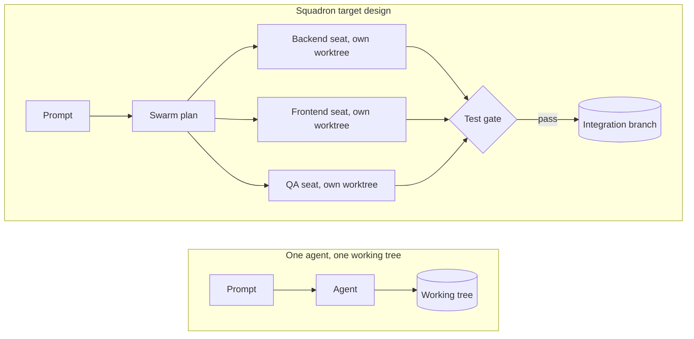

# Squadron 🚀

**Autonomous AI agent swarm orchestrator.** Led by Hasnain Abbas ([@hasnain112e](https://github.com/hasnain112e)) and built on the [OpenRig](https://github.com/mvschwarz/openrig) runtime by mvschwarz and contributors.

[](LICENSE)  -lightgrey)

> Squadron is a pre-release fork in active development. The table below separates what works today from what is planned.

## Why Squadron?

Running coding agents one at a time is slow. Running several in one working tree is worse: they overwrite each other's files and configuration (OpenRig [issue #64](https://github.com/mvschwarz/openrig/issues/64) is a real case).

Squadron's goal is to run parallel agent squads in isolated Git worktrees, check every lane with tests, and land the result on an integration branch.

| Capability | Status |
| --- | --- |
| `squad` command, with `rig` kept as an alias | Available |
| CLI builds and installs natively on Windows | Available |
| Multi-agent rigs, queues, workflows, snapshot and restore (inherited from OpenRig, needs tmux) | Available |
| `squad swarm <prompt>` | Preview: prints a backend, frontend and QA plan; launches nothing |
| One Git worktree per agent | Available in rig specs: set `isolation: worktree` on a member. `squad swarm` does not use it yet |
| Test gate before landing | Available in rig specs: `gate:` on a member, `squad gate run`, and `squad land`, which merges gated seats onto an integration branch and gates the result. `squad swarm` does not use them yet |
| Per-seat credential profiles | Planned |
| Running agents on Windows through psmux | Experimental upstream work, not merged |

## How it fits together



This is the target design. Today the plan step is a preview. Worktree isolation, the gate and landing work for rig spec members, but `squad swarm` does not launch or land them yet.

## Quickstart

Requires Node.js 22 or 24 and git. Running agents also needs tmux and a logged-in Claude Code or Codex, on macOS or Linux.

```bash
git clone https://github.com/hasnain112e/squadron.git
cd squadron
npm ci
npm run build -w packages/daemon
npm run build -w packages/cli
npm install -g ./packages/cli
```

This puts `squad` on your PATH, along with the `rig` alias that the bundled skills and hooks call by name. npm 11 may warn that the package's postinstall check is not allowed by `allowScripts`. The install still completes.

Preview a squad plan:

```bash
squad swarm "Build Auth API"
```

```text
Swarm plan: Build Auth API
Mission:    build-auth-api
  backend  squad/build-auth-api/backend
           Build the server side of: Build Auth API
  frontend squad/build-auth-api/frontend
           Build the client side of: Build Auth API
  qa       squad/build-auth-api/qa
           Write and run tests for: Build Auth API, after backend and frontend land

Preview only. The lanes are a fixed backend / frontend / qa template, not an agent's split of your prompt.
Agent launch is not implemented in this version. To try the rest today, give rig spec members `isolation: worktree` and a `gate`, then land the gated seats with `squad land`.
```

To run a real team of agents today, use the workflow inherited from OpenRig (macOS or Linux, with tmux):

```bash
squad up first-project --cwd .
squad ps --nodes --rig first-project
squad launch --help   # launch or relaunch a node in a running rig
```

Seats that share a repository overwrite each other's files. Add `isolation: worktree` to a member in your rig spec and that seat gets its own git worktree and branch (`squad/<rig>/<member>`) when it launches. `squad sandbox ls` lists them, and nothing is deleted unless you run `squad sandbox rm`. See [worktree isolation](docs/reference/rig-spec.md#worktree-isolation).

Give those members a `gate` (and, if they need dependencies, a `setup`) and you can check and combine their work:

```yaml
isolation: worktree
setup: ["npm", "ci"]     # once, in each fresh worktree
gate: ["npm", "test"]    # decides whether this seat's work may land
```

```bash
squad gate run <node-id>   # run a seat's gate; the result belongs to the commit it tested
squad land <rig>           # merge every gated seat onto squad/<rig>/integration, then gate the result
squad land <rig> --reset   # throw the integration branch away; the seats' branches stay
```

`squad land` merges only the exact commit that passed its gate, stops at the first conflict and leaves the branch as it was, and never changes your own branches. See [setup, gate and landing](docs/reference/rig-spec.md#setup-gate-and-landing).

The [guided first-use path](docs/reference/getting-started.md) walks through it. It is written for `rig`; every command works the same with `squad`. Read [what Squadron changes on your machine](#what-openrig-changes-on-your-machine) before you launch a rig.

## Concept demo

[assets/swarm-visualizer.html](assets/swarm-visualizer.html) is a scripted animation of the target workflow: three agents in separate worktrees, a test gate that blocks and then passes, and a landing on an integration branch. It is a simulation, not live output.

```bash
node scripts/demo-simulation.mjs            # copies it to your Downloads folder
node scripts/demo-simulation.mjs --out .    # or to a folder you choose
```

Open `squadron-visualizer.html` in a browser. Add `?t=20&paused=1` to its address to freeze a moment.

## Built on OpenRig

Squadron is a fork of [OpenRig](https://github.com/mvschwarz/openrig) v0.6.1, licensed under Apache 2.0. The daemon, runtime adapters, terminal UI, queues, workflows and the tmux control layer come from OpenRig, and this repository keeps its full history and authorship. What Squadron adds so far is the `squad` command and `rig` alias, a native Windows build of the CLI, the `squad swarm` preview, per-seat git worktrees (`isolation: worktree`), and a per-seat test gate with `squad land`. Credential profiles and launching a squad from `squad swarm` are the next milestones.

[NOTICE](NOTICE) records the attribution. Squadron is not affiliated with or endorsed by the OpenRig project. For the inherited features in depth, see the [OpenRig README](https://github.com/mvschwarz/openrig#readme).

## What OpenRig changes on your machine

OpenRig writes instance state, provider integration and workspace files as part
of setup and operation. These include **trust settings and executable hooks**.
The summary below follows this source revision; check `rig --version` when
using a published package, since repository guidance can be ahead of npm.

| When | What changes and why |
| --- | --- |
| **npm installation** | Installs the CLI, bundled components and dependencies under your npm prefix (with Bun, under Bun's global directory). OpenRig's postinstall checks the Node.js version and that the SQLite module loads; Bun may block this script. It does not run daemon or provider setup. |
| **`rig setup`** | Attempts missing tools and writes an OpenRig block in `~/.tmux.conf` for mouse support and scrollback. On macOS it can install cmux and enable its automation socket control in `~/.config/cmux/settings.json`. `--full` adds workstation tools. `--dry-run` shows setup's plan without applying it. |
| **Daemon startup** | Creates/updates instance state under `OPENRIG_HOME` (normally `~/.openrig`), including its database and managed plugin resources. Seeds the `openrig-skills` discovery skill in `~/.claude/skills` and `~/.agents/skills`, subject to existing version ownership. With `runtime.codex.hooks_enabled` enabled (the default), writes Codex hook configuration and trust records as described below—even before a rig launches. |
| **Rig/seat launch and attachment** | Creates tmux sessions, supplies seat identity and daemon connection environment, and projects selected guidance, skills, plugins and runtime resources into the workspace. Managed startup pre-trusts the workspace. Claude context collection can also be provisioned for attached sessions and refreshed during monitoring. |
| **Explicit permission configuration** | The built-in bootstrap does **not** add `rig` command allow rules. Agent-guided setup recommends Yes and requires your actual answer before the agent [adds rules at your chosen scope](docs/reference/getting-started.md#have-your-agent-configure-permissions). No/no answer preserves settings; existing choices and stricter rules remain relevant. Broader access is separate. |

The provider files are separate from instance state. Here `~` means the daemon
user's home; changing `OPENRIG_HOME` alone does not isolate provider configuration.

- **Claude Code:** managed startup writes workspace trust and onboarding completion
  to `~/.claude.json`. In the workspace, `.claude/settings.local.json` receives
  the context collector's `statusLine` command and selected activity hooks;
  helper scripts live under `.openrig/`. Selected settings/MCP resources can also
  change that settings file and `.mcp.json`. The shared settings resource sets
  `permissions.defaultMode` to `acceptEdits` and enables Exa/Context7 MCP entries;
  selected MCP resources configure those external services. Built-in bootstrap
  no longer writes a command allowlist to `~/.claude/settings.json` or removes
  older allowances. The trust writer uses the daemon home, so a custom
  `CLAUDE_CONFIG_DIR` is not a general relocation of these writes.
- **Codex:** writes the daemon's `CODEX_HOME/config.toml` (normally
  `~/.codex/config.toml`). Startup enables hooks, adds the OpenRig activity relay
  commands and pre-writes trust hashes for those commands. Seat startup adds
  `trust_level = "trusted"` for the workspace; selected config resources can
  add MCP settings. Recognized update notices can be skipped during launch,
  recording the skipped version in Codex's cache; this is not an update install.

Activity relays send event type/subtype, seat/runtime identity, timestamps and
native session identity to the configured OpenRig daemon's `/api/activity/hooks`
endpoint, using its activity token. That payload excludes prompt text and tool
arguments. Claude's collector writes context/token usage, session/transcript-path
metadata and available rate-limit data to the instance's `state/context-usage`
and `state/provider-usage`. Provider and selected MCP connections have their own
data flows. Daemon plugin initialization also checks the OpenRig plugin release
endpoint on GitHub.

Managed launches supply `HOME`, `CODEX_HOME` and `OPENRIG_*` identity/connection
variables. Claude uses `--permission-mode acceptEdits` and defaults to the classic
renderer for terminal scrollback. Codex uses `-s workspace-write` unless a named
profile governs its sandbox; the default does not force an approval-policy flag.
Fresh Codex launches also add writable access to the workspace's `.git` and the
pod's shared queue-state directory with `--add-dir`; the shared root comes from
`OPENRIG_SHARED_DOCS_ROOT` or `~/.openrig/shared-docs`.
YOLO is **off by default**. An explicitly selected full-bypass policy selects
Claude's `--dangerously-skip-permissions` or Codex's
`-s danger-full-access -a never`. The legacy environment-only `OPENRIG_YOLO=1`
path still selects only Codex's sandbox; a resolved policy overrides that
environment setting.

Permission mode controls native execution permissions; work posture is separate
project guidance. Use `rig policy permissions list|show|current|apply` for rig
policy configuration (the four `rig policy` aliases remain compatible). Use
`rig seat set-permissions <seat> --mode <mode> --reason <text>` for an audited
future-launch choice: `floor`, `full_bypass`, or `inherit` to clear the seat
override. Additional Claude modes such as `auto` require support from the exact
managed Claude executable at the seat's working directory; selection and launch
each check it. Unsupported or changed contexts refuse without a fallback.
This does not relaunch the seat
or change its current native process, history, rules or hooks. `rig seat status`
separates the desired selection from the last launch arguments; neither proves
native enforcement. See the [permission guide](docs/reference/getting-started.md#per-seat-permission-mode).

Managed hook blocks target OpenRig's entries and retain unrelated hooks, but
trust entries, selected resource keys and Claude's existing status-line command
can be replaced. Some writers recover unreadable settings as empty objects;
this is not a complete preservation or rollback guarantee. Back up relevant
files before first use. Daemon/bootstrap writes are automatic and do not each
have an interactive preview; `rig setup --dry-run` does not preview every later
startup effect.

## Upgrading an existing instance

These notes are inherited from OpenRig. They describe upgrading an OpenRig instance whose state lives under `OPENRIG_HOME`, which Squadron reads as well. Where they say `npm install -g @openrig/cli`, that installs the upstream OpenRig package. To run Squadron, install from source as in the [Quickstart](#quickstart).

For an existing installation, follow the [upgrade procedure](skills/_canonical/core/openrig-upgrade/SKILL.md) and the [0.5.14 release notes](docs/releases/v0.5.14.md). Preserve live seats during the upgrade; `rig down` is not an upgrade step. Upgrading to 0.6.0 also requires Node.js 22 or 24: see [Moving off Node 20](#moving-off-node-20) and the [0.6.0 release notes](docs/releases/v0.6.0.md).

### Moving off Node 20

OpenRig 0.6.0 supports Node.js 22 and 24 only. Its SQLite binding
(better-sqlite3 13) requires Node 22 or newer. Node 20 is no longer supported;
the install check refuses it with an explanation.

If you run OpenRig on Node 20, switch Node first, then reinstall the CLI under
the new Node (a version manager keeps a separate global package set for each
Node):

```bash
nvm install 22          # or 24; fnm or your package manager work the same way
npm install -g @openrig/cli
rig --version
```

Your existing OpenRig data stays where it is. The daemon reopens the same
database under the new binding and applies any pending migrations in place.
Restart the daemon under the new Node by following the upgrade procedure above.

### Crossing the 0.5.9 layout boundary

The migration below still applies when upgrading from a pre-0.5.9 instance.

0.5.9 makes `$OPENRIG_HOME/context` the addressable context library, writes
Claude telemetry to `state/context-usage` (and provider telemetry to
`state/provider-usage`), and installs the default System World at
`context/system/system-world.yaml`. Existing instances cross this boundary by
an **Agent-Operated Migration** from the shipped `openrig-upgrade` skill. The
target runtime reads canonical-first with legacy-fallback while new writes use
the canonical roots; a custom context-library root stays stable during
activation. This is not a directory rename to do while an old collector writes.

```bash
# SKILL_DIR is the installed openrig-upgrade skill directory.
node "$SKILL_DIR/scripts/migrate-telemetry-state-0.5.9.mjs" --help
node "$SKILL_DIR/scripts/migrate-telemetry-state-0.5.9.mjs" --home "$OPENRIG_HOME"
node "$SKILL_DIR/scripts/migrate-telemetry-state-0.5.9.mjs" --home "$OPENRIG_HOME" --apply-state --preimage /safe/path/layout-0.5.9-before

# Activate the exact target runtime separately. After every bounded legacy tail is followed by newer paired samples at both new state roots:
node "$SKILL_DIR/scripts/migrate-telemetry-state-0.5.9.mjs" --home "$OPENRIG_HOME" --verify --preimage /safe/path/layout-0.5.9-before > /safe/path/layout-0.5.9-verify.json

# Run the separately invoked non-destructive finalizer only with that exact receipt:
node "$SKILL_DIR/scripts/migrate-telemetry-state-0.5.9.mjs" --home "$OPENRIG_HOME" --apply-library --preimage /safe/path/layout-0.5.9-before --verification /safe/path/layout-0.5.9-verify.json

# Restore only helper-owned preparation/finalizer effects if the observed upgrade must be reversed:
node "$SKILL_DIR/scripts/migrate-telemetry-state-0.5.9.mjs" --home "$OPENRIG_HOME" --rollback /safe/path/layout-0.5.9-before
```

`--help` prints the phase grammar without inventorying the instance. No phase
flag intentionally runs the read-only plan; unknown options fail nonzero before
plan or mutation.

Every phase emits JSON. Stop on any issue or incomplete receipt and follow its
`next` action; do not continue from copied legacy telemetry or retry a partial
mutation blindly. Preparation leaves legacy state and collector settings in
place. Verification accepts exact tail bytes only when that same seat has newer
paired context and provider samples under `state/`; finalization revalidates the
accepted tails, copies the library without overwrite, and switches config last.
The helper never removes the legacy telemetry or library. Retirement follows
separate stable runtime, writer, reader, and recovery proof. Daemon, database,
seat, plugin, and release lifecycle actions remain agent-owned.

## Community and security

- **Bugs and feature requests:** [open an issue](https://github.com/hasnain112e/squadron/issues/new/choose).
- **Contributing:** [CONTRIBUTING.md](CONTRIBUTING.md) · [Code of Conduct](CODE_OF_CONDUCT.md) · [Security policy](SECURITY.md) · [Getting help](.github/SUPPORT.md)

## License

Apache 2.0. See [LICENSE](LICENSE) and [NOTICE](NOTICE).
